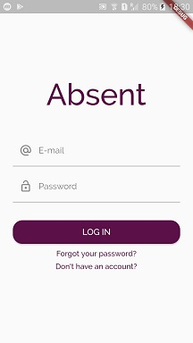
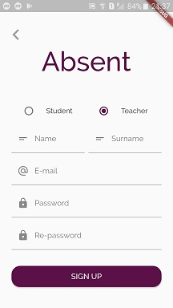
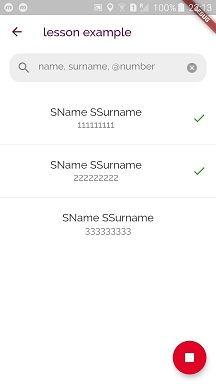
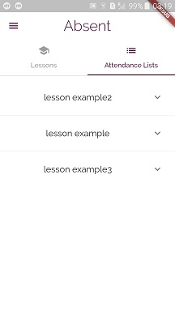
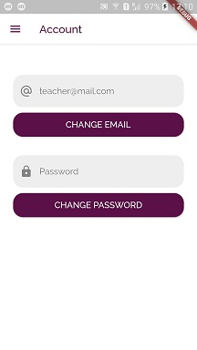
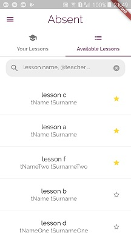
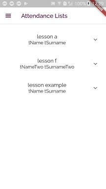

# Absent
Absent is a location based attendance application for teachers and students. I started to develope the Absent for a school project and so it became my first Flutter application. In fact, it was only for iOS and Android, and therefore the web version doesn't look that well. 

# Purpose
The main purpose of the Absent is to ease the attendance process that takes place in schools for both students and teachers. Using the Absent, students and teachers can complete the attendance process via their phones without the need for any paper or pens.

# Very short use case example
<ul>
<li> Teacher and students register to the Absent
<li> The teacher creates a lesson to represent his real lesson
<li> Each student joins the lesson that teacher created
<li> The teacher starts to take attendance
<li> Each student attend to the attendance that the teacher started to take
<li> The teacher finishes the attendance
<li> The teacher and students can see the old attendance records
</ul>

# How does the attendance process work?
The whole attendance process in the Absent is done according to the location of the teacher and students. When the teacher wants to take attendance, he needs to determine the valid radius ([8-99] meters). In order for students to attend the attendance, they have to be in the radius that the teacher determined, otherwise they encounter an error message. For example, if the radius is 10 meters, students who are more than 10 meters away from the teacher are not be able to attend the attendance.

# Screenshots of the main screens (Android)
Absent also has many dialogs (sub-screens), but they are not included.
## Login Screen 
 
## Sign Up Screen
 
## Teacher Lesson List Screen
 
## Teacher Lesson Screen
 
## Teacher Attendance Lists Screen
 
## Teacher Classroom Screen
 
## Teacher Menu Screen
 
## Teacher Account Screen
 
## Student Available Lessons Screen
 
## Student Joined Lessons Screen
  
## Student Attendance Lists Screen
 
## Student Menu Screen

## Student Account Screen
 
